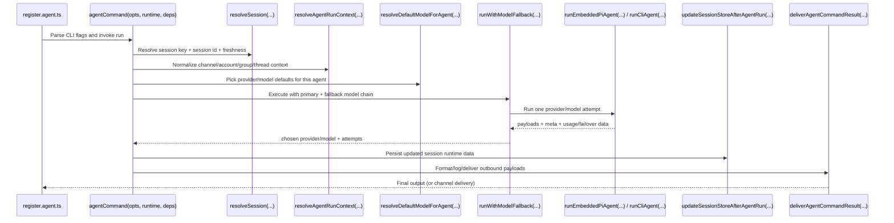

# Agent Components (`src/commands` + `src/agents`)

This page is a practical map for contributors working on:

- `src/commands/agent/*` and `src/commands/agent.ts` (run one agent turn)
- `src/commands/agents.*.ts` (manage configured agents and routing bindings)
- `src/agents/*` (runtime engine, model selection/fallback, workspace, skills)

## Folder map clarification

- `src/commands/agent/` **does exist** (singular) and contains shared run helpers used by `src/commands/agent.ts`.
- There is currently **no** `src/commands/agents/` directory (plural).  
  The `openclaw agents ...` management commands are flat files under `src/commands/`, such as:
  - `src/commands/agents.commands.add.ts`
  - `src/commands/agents.commands.list.ts`
  - `src/commands/agents.commands.delete.ts`
  - `src/commands/agents.commands.bind.ts`
  - `src/commands/agents.commands.identity.ts`

## ASCII component map

```text
CLI register/route layer
  src/cli/program/register.agent.ts
            |
            +---------------------------------------------+
            |                                             |
            v                                             v
 run flow: openclaw agent                      manage flow: openclaw agents ...
 src/commands/agent.ts                         src/commands/agents.commands.*.ts
            |                                             |
            |                                             +--> config and bindings
            |                                                  src/commands/agents.bindings.ts
            |                                                  src/commands/agents.config.ts
            |
            +--> session/context helpers
            |      src/commands/agent/session.ts
            |      src/commands/agent/run-context.ts
            |      src/commands/agent/session-store.ts
            |      src/commands/agent/delivery.ts
            |
            +--> runtime selection
            |      runCliAgent(...)            (src/agents/cli-runner.ts)
            |      runEmbeddedPiAgent(...)     (src/agents/pi-embedded-runner/run.ts)
            |
            +--> core runtime supports
                   resolveSessionAgentIds(...)     src/agents/agent-scope.ts
                   resolveDefaultModelForAgent(...) src/agents/model-selection.ts
                   runWithModelFallback(...)       src/agents/model-fallback.ts
                   ensureAgentWorkspace(...)       src/agents/workspace.ts
                   buildWorkspaceSkillSnapshot(...) src/agents/skills/workspace.ts
```

## Main command-layer components

- `agentCommand(opts, runtime, deps)` in `src/commands/agent.ts`
  - Orchestrates one turn: validation, session resolution, model selection, fallback, run, persist, delivery.
  - Used by:
    - `src/commands/agent-via-gateway.ts` (`agentCliCommand` local mode/fallback)
    - `src/gateway/server-methods/agent.ts` (gateway RPC `agent`)
    - `src/gateway/openresponses-http.ts`, `src/gateway/openai-http.ts`, `src/gateway/boot.ts`

- `resolveSession(...)` in `src/commands/agent/session.ts`
  - Resolves/reuses session key and session id, freshness/reset behavior, and persisted thinking/verbose levels.
  - Used by `src/commands/agent.ts` and ACP session logic in `src/acp/control-plane/manager.core.ts`.

- `resolveAgentRunContext(opts)` in `src/commands/agent/run-context.ts`
  - Normalizes channel/account/group/thread context for downstream runtime + delivery.
  - Used by `src/commands/agent.ts`.

- `updateSessionStoreAfterAgentRun(...)` in `src/commands/agent/session-store.ts`
  - Persists model/provider actually used, usage tokens, compaction counts, and provider-specific session ids.
  - Used by `src/commands/agent.ts`.

- `deliverAgentCommandResult(...)` in `src/commands/agent/delivery.ts`
  - Normalizes payloads, handles JSON output mode, resolves delivery targets, and sends via outbound channel adapters.
  - Used by `src/commands/agent.ts`.

## Main `agents.*` management components

- `agentsListCommand(opts, runtime)` in `src/commands/agents.commands.list.ts`
  - Builds agent summaries (workspace/dir/model/routing/provider status).
  - Used by `src/cli/program/register.agent.ts` and `src/cli/program/routes.ts`.

- `agentsAddCommand(opts, runtime)` in `src/commands/agents.commands.add.ts`
  - Adds/updates an agent, initializes workspace, optional auth/channel setup, and optional bindings.
  - Used by `src/cli/program/register.agent.ts`.

- `agentsDeleteCommand(opts, runtime)` in `src/commands/agents.commands.delete.ts`
  - Removes agent config/bindings and moves workspace/state/session directories to trash.
  - Used by `src/cli/program/register.agent.ts`.

- `agentsBindingsCommand`, `agentsBindCommand`, `agentsUnbindCommand` in `src/commands/agents.commands.bind.ts`
  - List/add/remove routing bindings.
  - Used by `src/cli/program/register.agent.ts`.

- `agentsSetIdentityCommand(opts, runtime)` in `src/commands/agents.commands.identity.ts`
  - Sets identity from flags and/or `IDENTITY.md`.
  - Used by `src/cli/program/register.agent.ts`.

## Main runtime components in `src/agents`

- Agent scope and filesystem paths: `src/agents/agent-scope.ts`
  - `resolveSessionAgentIds(...)`, `resolveAgentWorkspaceDir(...)`, `resolveAgentDir(...)`.
  - Used by command flow, cron isolated runs, and runtime execution.

- Embedded runtime entrypoint: `src/agents/pi-embedded-runner/run.ts`
  - `runEmbeddedPiAgent(params): Promise<EmbeddedPiRunResult>`.
  - Handles queue lanes, model/provider resolution, hook integration, retries/compaction, and final payload/meta.
  - Used by `src/commands/agent.ts`, auto-reply runners, cron isolated runs, probes/hooks.

- Embedded attempt engine: `src/agents/pi-embedded-runner/run/attempt.ts`
  - `runEmbeddedAttempt(params): Promise<EmbeddedRunAttemptResult>`.
  - Does the low-level session/tool/system prompt wiring and streaming execution for one attempt.
  - Used by `runEmbeddedPiAgent(...)`.

- CLI backend runtime: `src/agents/cli-runner.ts`
  - `runCliAgent(params): Promise<EmbeddedPiRunResult>`.
  - Executes provider CLI backends with prompt/system prompt/session wiring.
  - Used by `src/commands/agent.ts`, cron isolated runs, and auto-reply execution paths.

- Model selection and allowlist logic: `src/agents/model-selection.ts`
  - `resolveConfiguredModelRef(...)`, `resolveDefaultModelForAgent(...)`, `normalizeModelRef(...)`, `isCliProvider(...)`.
  - Used across command flow, cron, and runtime setup.

- Model fallback execution: `src/agents/model-fallback.ts`
  - `runWithModelFallback(params): Promise<ModelFallbackRunResult<T>>`.
  - Tries primary + fallback candidates, tracks failover metadata/reasons, handles cooldown/profile constraints.
  - Used by `src/commands/agent.ts`, auto-reply runners, and cron isolated runs.

- Workspace bootstrap and safety: `src/agents/workspace.ts`
  - `ensureAgentWorkspace(params?): Promise<{ ... }>` plus bootstrap/template loading.
  - Used by command, cron, onboarding, and setup paths.

- Skills snapshot building: `src/agents/skills/workspace.ts`
  - `buildWorkspaceSkillSnapshot(workspaceDir, opts?): SkillSnapshot`.
  - Used by `src/commands/agent.ts` to pass a deterministic skills prompt into runs.

- Timeout policy: `src/agents/timeout.ts`
  - `resolveAgentTimeoutMs(...)`.
  - Used by `src/commands/agent.ts` and cron isolated runs.

## Pi agent vs CLI agent

`agentCommand(...)` chooses runtime per attempt in `runAgentAttempt(...)`:

- If `isCliProvider(providerOverride, cfg)` is `true` -> `runCliAgent(...)`
- Otherwise -> `runEmbeddedPiAgent(...)`

| Dimension        | Pi agent runtime                                                                                         | CLI agent runtime                                                                                              |
| ---------------- | -------------------------------------------------------------------------------------------------------- | -------------------------------------------------------------------------------------------------------------- |
| Main entrypoint  | `runEmbeddedPiAgent(...)` in `src/agents/pi-embedded-runner/run.ts`                                      | `runCliAgent(...)` in `src/agents/cli-runner.ts`                                                               |
| Selection logic  | Used when provider is not a CLI backend                                                                  | Used when provider resolves as CLI backend (`claude-cli`, `codex-cli`, or configured CLI backend)              |
| Where selected   | `runAgentAttempt(...)` in `src/commands/agent.ts`                                                        | `runAgentAttempt(...)` in `src/commands/agent.ts`                                                              |
| Tool calling     | Full tool pipeline (OpenClaw tools, tool loop protection, sandbox/tool policy, tool result processing)   | Tools disabled for the run (`runCliAgent` appends: `"Tools are disabled in this session. Do not call tools."`) |
| Skills usage     | Uses workspace skills snapshots/prompts (`buildWorkspaceSkillSnapshot(...)` + embedded run prompt build) | Does not use embedded tool/skill execution pipeline; behaves as external CLI model execution                   |
| Session engine   | Pi session manager / transcript pipeline (`runEmbeddedAttempt(...)` and session manager wiring)          | CLI backend process execution via `cli-runner/helpers.ts` (args/stdin/json parsing/session id mapping)         |
| Best for         | OpenClaw-native agent features: tools, richer channel-aware behavior, advanced embedded runtime controls | Backends that must run through vendor CLI/OAuth/CLI session semantics                                          |
| Typical tradeoff | More integrated and feature-rich inside OpenClaw                                                         | Simpler bridge to external CLI behavior, but with reduced OpenClaw-native capabilities                         |
| Used from        | `agentCommand(...)`, auto-reply runners, cron isolated agent runs                                        | `agentCommand(...)`, auto-reply runners, cron isolated agent runs (when provider is CLI type)                  |

### Quick contributor rule

- If your feature touches tools, tool policies, embedded streaming, or session-manager internals, start with the Pi path (`src/agents/pi-embedded-runner/*`).
- If your feature is specific to external CLI backend invocation (argv, resume args, CLI parsing/timeouts), start with `src/agents/cli-runner.ts` and `src/agents/cli-runner/helpers.ts`.

## Deep dive: `runEmbeddedPiAgent(...)`

Permalink to function declaration: [runEmbeddedPiAgent (L192-L193)](https://github.com/openclaw/openclaw/blob/main/src/agents/pi-embedded-runner/run.ts#L192-L193)

At a high level, this function is the **embedded runtime orchestrator** for one agent turn. It does not just "call the model"; it coordinates queueing, model/auth setup, retries, overflow recovery, and output shaping into a single `EmbeddedPiRunResult`.

### Functional logic (step-by-step)

1. Queue and lane control
   - Resolves a per-session lane and global lane, then runs the turn inside both queues.
   - Purpose: avoid unsafe concurrent session writes and reduce cross-run contention.

2. Workspace and model bootstrap
   - Resolves effective workspace (`resolveRunWorkspaceDir(...)`) with fallback-aware logging.
   - Resolves provider/model and validates context window guardrails.
   - Loads model/auth registry data (`ensureOpenClawModelsJson(...)`, `resolveModel(...)`).

3. Hook-based model override
   - Executes plugin hooks (`before_model_resolve`, legacy `before_agent_start`) that can override provider/model before model resolution is finalized.

4. Auth profile resolution + rotation policy
   - Loads auth profile order and picks candidate profile(s).
   - Supports pinned profile behavior (for user-selected profile).
   - Rotates profile on supported failover classes (rate limit/auth/billing/timeout), respecting cooldowns.

5. Main run loop with attempt execution
   - Calls `runEmbeddedAttempt(...)` for each iteration.
   - Accumulates usage and compaction metadata.
   - Handles retry paths for:
     - unsupported thinking levels
     - failover-class prompt/assistant errors
     - auth/profile rotation opportunities

6. Context overflow recovery path
   - Detects overflow from prompt/assistant errors.
   - Tries explicit compaction (`compactEmbeddedPiSessionDirect(...)`) with capped attempts.
   - If needed, truncates oversized tool results in transcript.
   - Returns a user-facing overflow error payload when recovery is exhausted.

7. Final payload/meta shaping
   - Builds outbound payloads (`buildEmbeddedRunPayloads(...)`).
   - Emits timeout-specific error payload if no assistant output exists.
   - Marks auth profile good/used on successful completion.
   - Returns normalized `payloads + meta` and messaging-tool delivery metadata.

8. Cleanup invariant
   - Always restores the previous process working directory in `finally`.

### ASCII flow

```text
runEmbeddedPiAgent(params)
  |
  +--> enqueueSession(...) -> enqueueGlobal(...)
         |
         +--> resolve workspace + model + context guard
         +--> resolve auth profile candidates
         |
         +--> loop:
                runEmbeddedAttempt(...)
                  |
                  +--> success? --------------------------+
                  |                                       |
                  +--> prompt/assistant error             |
                         |                                |
                         +--> overflow? -> compaction/truncate -> retry
                         +--> failover/profile issue -> rotate profile -> retry
                         +--> unsupported thinking -> lower thinking -> retry
                         +--> unrecoverable -> return error payload/meta

         +--> buildEmbeddedRunPayloads(...)
         +--> return EmbeddedPiRunResult
         +--> finally: restore cwd
```

### Recovery sub-flow (overflow path)

```text
overflow detected
  |
  +--> had in-attempt compaction?
  |      +--> yes: retry (bounded)
  |      +--> no: compactEmbeddedPiSessionDirect(...)
  |               +--> compacted -> retry
  |               +--> not compacted -> check oversized tool results
  |
  +--> truncateOversizedToolResultsInSession(...)
         +--> truncated -> retry
         +--> not truncated -> return context-overflow error payload
```

### How and when `runEmbeddedPiAgent(...)` is invoked

It is invoked either:

- **indirectly** through `agentCommand(...)` (most user-facing `openclaw agent` and gateway `agent` requests), or
- **directly** by internal subsystems that need embedded LLM execution.

#### Invocation chain (common request path)

```text
CLI / Gateway request
  -> agentCommand(...)                src/commands/agent.ts
      -> runWithModelFallback(...)
          -> runAgentAttempt(...)
              -> if isCliProvider(...) then runCliAgent(...)
                 else runEmbeddedPiAgent(...)
```

#### Invocation references (with permalinks)

| Caller                                                                                                                                            | How invoked                                                                                                           | When this path is used                                                              |
| ------------------------------------------------------------------------------------------------------------------------------------------------- | --------------------------------------------------------------------------------------------------------------------- | ----------------------------------------------------------------------------------- |
| [`src/commands/agent.ts`](https://github.com/openclaw/openclaw/blob/main/src/commands/agent.ts)                                                   | `runAgentAttempt(...)` chooses embedded path when `isCliProvider(...)` is false, then calls `runEmbeddedPiAgent(...)` | Primary path for `openclaw agent` turns when selected provider is not a CLI backend |
| [`src/commands/agent-via-gateway.ts`](https://github.com/openclaw/openclaw/blob/main/src/commands/agent-via-gateway.ts)                           | Calls `agentCommand(...)` directly in local mode, or as fallback after gateway failure                                | CLI user runs `openclaw agent` with gateway/local fallback behavior                 |
| [`src/gateway/server-methods/agent.ts`](https://github.com/openclaw/openclaw/blob/main/src/gateway/server-methods/agent.ts)                       | Calls `agentCommand(...)` for RPC `agent` method                                                                      | Gateway clients trigger `agent` runs over WS/RPC                                    |
| [`src/auto-reply/reply/agent-runner-execution.ts`](https://github.com/openclaw/openclaw/blob/main/src/auto-reply/reply/agent-runner-execution.ts) | Inside `runWithModelFallback(...)`, calls embedded runner for non-CLI providers                                       | Inbound auto-reply turn execution for ongoing conversations                         |
| [`src/auto-reply/reply/followup-runner.ts`](https://github.com/openclaw/openclaw/blob/main/src/auto-reply/reply/followup-runner.ts)               | Direct embedded call in fallback-run wrapper                                                                          | Follow-up queued runs after initial reply workflows                                 |
| [`src/auto-reply/reply/agent-runner-memory.ts`](https://github.com/openclaw/openclaw/blob/main/src/auto-reply/reply/agent-runner-memory.ts)       | Direct embedded call for memory flush prompt                                                                          | Memory maintenance / summarization-style flush runs                                 |
| [`src/cron/isolated-agent/run.ts`](https://github.com/openclaw/openclaw/blob/main/src/cron/isolated-agent/run.ts)                                 | Inside cron fallback runner, selects embedded when provider is non-CLI                                                | Scheduled isolated agent jobs                                                       |
| [`src/commands/models/list.probe.ts`](https://github.com/openclaw/openclaw/blob/main/src/commands/models/list.probe.ts)                           | Direct embedded call with probe session settings                                                                      | Provider/auth probe checks from model tooling                                       |
| [`src/hooks/llm-slug-generator.ts`](https://github.com/openclaw/openclaw/blob/main/src/hooks/llm-slug-generator.ts)                               | Direct embedded one-off call with temporary session                                                                   | Generates LLM-based filename slugs for session memory                               |

#### Practical rule

- If you are debugging a user-facing `agent` run, start at `src/commands/agent.ts` and track whether provider selection routes to embedded vs CLI.
- If you are debugging background behavior (follow-ups, memory flush, cron, probes), inspect the direct-call sites above first, then step into `runEmbeddedPiAgent(...)`.

### Sequence diagram (channel message -> PI agent)

```text
Telegram update
  -> registerTelegramHandlers(...)
  -> processMessage(...)
  -> dispatchTelegramMessage(...)
  -> dispatchReplyWithBufferedBlockDispatcher(...)
  -> dispatchReplyFromConfig(...)
  -> getReplyFromConfig(...)
  -> runPreparedReply(...)
  -> runReplyAgent(...)
     -> check active/streaming run state

     if queue mode = steer AND run is already streaming:
       -> queueEmbeddedPiMessage(sessionId, prompt)
       <- queued into active run
     else:
       -> runAgentTurnWithFallback(...)
       -> runEmbeddedPiAgent({ prompt: commandBody, ... })
       <- payloads + meta
       <- run outcome
```

### globalLane vs sessionLane (embedded runner)

`runEmbeddedPiAgent(...)` uses two queue lanes before any model call:

- `sessionLane`: derived from `sessionKey` (or `sessionId` fallback), normalized to `session:<key>`.
  - Purpose: serialize all work for the same conversation/session so turns do not interleave.
  - Resolver: `src/agents/pi-embedded-runner/lanes.ts` (`resolveSessionLane`).
- `globalLane`: derived from `params.lane` (or default `main`).
  - Purpose: place the run into a broader scheduling class (for example, default main lane vs other lanes).
  - Resolver: `src/agents/pi-embedded-runner/lanes.ts` (`resolveGlobalLane`).

Execution shape in `src/agents/pi-embedded-runner/run.ts`:

```text
enqueueSession(() =>
  enqueueGlobal(async () => {
    // actual embedded run logic
  })
)
```

So a run must pass both gates: session-level ordering and global lane ordering.

### What it takes to run `runEmbeddedPiAgent(...)`

At minimum (operational core):

- `sessionId` (run/session identity)
- `sessionFile` (transcript persistence path)
- `workspaceDir` (working directory for run context/tools)
- `prompt` (user/system-assembled input to execute)
- `timeoutMs` and `runId` (lifecycle/telemetry controls)

Commonly provided runtime context:

- Model/runtime: `provider`, `model`, `thinkLevel`, `reasoningLevel`, `verboseLevel`
- Routing/channel: `messageChannel`/`messageProvider`, `agentAccountId`, `messageTo`, `messageThreadId`
- Actor/session metadata: `sessionKey`, `agentId`, `groupId`, `groupChannel`, `groupSpace`, `spawnedBy`
- Sender metadata: `senderId`, `senderName`, `senderUsername`, `senderE164`, `senderIsOwner`
- Tool and streaming controls: `disableTools`, `clientTools`, callbacks (`onPartialReply`, `onBlockReply`, `onToolResult`, etc.)

### How metadata is used

- Queueing/scheduling:
  - `sessionKey`/`sessionId` -> `sessionLane` for per-session serialization.
  - `lane` -> `globalLane` for broader queue partitioning.
- Tool policy + action capability:
  - `messageChannel`/`messageProvider`, `agentAccountId`, `group*`, `sender*`, `spawnedBy`, `replyToMode`, thread/message ids feed `createOpenClawCodingTools(...)` policy checks and action hints.
- System prompt + channel behavior:
  - Channel metadata drives capability hints (for example inline buttons/reactions/channel actions) in prompt/runtime setup.
- Transcript persistence/guarding:
  - `sessionFile` opens guarded `SessionManager`; `inputProvenance` can be attached to persisted user messages.
- Output formatting/delivery:
  - Channel hint influences `toolResultFormat` (`markdown` vs `plain`), and callbacks stream partial/block/tool outputs back to caller surfaces.
- Telemetry/meta result:
  - `sessionId`, final provider/model, usage, compaction count are returned as `meta.agentMeta`.

### Flowchart (runEmbeddedPiAgent decision flow)

```text
[START]
   |
   v
[Process] Receive RunEmbeddedPiAgentParams
   |
   v
[Process] Resolve sessionLane = session:<sessionKey|sessionId>
   |
   v
[Process] Resolve globalLane = lane or "main"
   |
   v
[Process] Enqueue on session lane
   |
   v
[Process] Enqueue on global lane
   |
   v
[Decision] Workspace resolved?
  |Yes                                  |No
  v                                     v
[Process] Continue                      [Stop] Return error payload/meta
   |
   v
[Process] Resolve provider/model + auth profile + hooks
   |
   v
[Decision] Retry/compaction/auth failover needed?
  |Yes                                  |No
  v                                     v
[Process] Adjust model/profile/prompt   [Process] Continue
          and retry loop
   |___________________________________________
                   |
                   v
[Process] runEmbeddedAttempt(...)
   |
   v
[Decision] Streaming active and steer message queued?
  |Yes                                  |No
  v                                     v
[Process] steer into active session     [Process] normal turn execution
   |                                     |
   |_____________________________________|
                   |
                   v
[Process] Build payloads + agentMeta (usage, provider/model, compaction count)
   |
   v
[STOP] Return EmbeddedPiRunResult
```

### How responses differ by runtime mode

This is the practical behavior split between normal PI turns, subagent turns, and cron isolated turns.

#### 1) Normal PI agent response (user-facing channel turn)

What happens:

- Inbound channel message goes through provider handlers (`telegram`, `discord`, etc.) into auto-reply dispatch.
- `getReplyFromConfig(...)` builds session context and calls `runPreparedReply(...)`.
- `runReplyAgent(...)` either:
  - steers into an active streaming run via `queueEmbeddedPiMessage(...)`, or
  - executes a fresh turn via `runAgentTurnWithFallback(...)` -> `runEmbeddedPiAgent(...)`.
- Final payloads are delivered back to the originating channel.

Typical scenario:

- User sends: "Summarize this error and suggest a fix" in Telegram.
- System runs normal PI turn and posts answer to same Telegram chat/thread.

Message flow (normal):

```text
[START user message]
  -> Channel handler (e.g. Telegram)
  -> Auto-reply dispatch stack
  -> runReplyAgent(...)
  -> [Decision] active streaming run + steer mode?
       -> Yes: queueEmbeddedPiMessage(...)
       -> No: runEmbeddedPiAgent(...)
  -> Build final payloads
  -> Deliver to originating channel
[STOP]
```

#### 2) Subagent operation (spawned helper sessions)

What happens:

- Parent agent uses `sessions_spawn` tool -> `spawnSubagentDirect(...)`.
- Child session is created (`agent:<id>:subagent:<uuid>`), registered in subagent registry, then started with `channel=internal`, `deliver=false`, lane `subagent`.
- Child runs PI turn independently.
- On completion, `runSubagentAnnounceFlow(...)` sends a completion summary back to requester session (or outward if configured).
- Parent can orchestrate via `subagents` tool (`list`, `steer`, `kill`).

Typical scenario:

- Parent agent receives "audit these 4 files".
- Parent spawns two subagents for parallel checks.
- Each child posts completion back; parent synthesizes and sends one final user response.

Message flow (subagent):

```text
[START parent task]
  -> parent uses sessions_spawn
  -> spawnSubagentDirect(...)
  -> create child session + register run
  -> call gateway agent (deliver=false, internal channel, lane=subagent)
  -> child run executes PI turn
  -> [Decision] child finished?
       -> No: continue
       -> Yes: runSubagentAnnounceFlow(...)
             -> [Decision] requester active/queue mode?
                  -> steer/queue/direct announce path
             -> completion injected back to requester session
  -> parent may use subagents(list/steer/kill)
[STOP parent orchestrates final response]
```

#### 3) Cron isolated agent response (scheduled jobs)

What happens:

- Cron scheduler triggers `runCronIsolatedAgentTurn(...)`.
- It resolves agent/session/model/timeouts and runs `runEmbeddedPiAgent(...)` (or CLI provider path).
- Output is then routed by `dispatchCronDelivery(...)`:
  - direct outbound delivery when structured payload/thread target requires it, or
  - announce-style delivery through main/requester session for text summaries.
- Handles best-effort delivery and avoids duplicate sends when messaging tools already delivered.

Typical scenarios:

- Daily summary cron job: generate text summary and announce it back to main session/channel.
- Media/report cron job: returns structured payload (media/buttons) and uses direct delivery path.

Message flow (cron isolated):

```text
[START cron trigger]
  -> runCronIsolatedAgentTurn(...)
  -> resolve session/model/auth/workspace
  -> runEmbeddedPiAgent(...) (lane usually "cron")
  -> collect payloads + telemetry
  -> dispatchCronDelivery(...)
  -> [Decision] delivery requested?
       -> No: return run result only
       -> Yes:
          -> [Decision] structured payload or thread target?
               -> Yes: direct outbound delivery
               -> No: announce flow via main/requester session
  -> [Decision] bestEffort enabled?
       -> No: delivery error fails run
       -> Yes: log warning, keep run as ok when possible
[STOP]
```

#### Quick comparison

- Normal PI turn: user message in -> user-facing reply out (same channel/session).
- Subagent: parent task in -> child isolated execution -> completion back to parent/requester session.
- Cron isolated: scheduler event in -> isolated run -> delivery via direct outbound or announce path.

### Where Pi tools are loaded and executed

Pi-agent tool orchestration primarily happens inside `runEmbeddedAttempt(...)`, not in the outer `runEmbeddedPiAgent(...)` wrapper.

#### Tool loading pipeline

```text
runEmbeddedAttempt(...)
  |
  +--> createOpenClawCodingTools(...)      // build raw tool catalog from config/policies/channel/sandbox
  +--> sanitizeToolsForGoogle(...)          // provider-specific schema/tool constraints
  +--> collectAllowedToolNames(...)         // allowlist for transcript/tool-result guards
  +--> splitSdkTools(...)                   // built-in SDK tools vs custom tools
  +--> toClientToolDefinitions(...)         // add client-hosted tools (if provided)
  +--> createAgentSession({ tools, customTools, ... })
```

#### Tool execution pipeline

```text
activeSession.prompt(...)
  |
  +--> model emits tool execution events
  +--> subscribeEmbeddedPiSession(...) attaches event handlers
         |
         +--> handleToolExecutionStart / Update / End
         +--> emit tool summaries + outputs (when enabled)
         +--> capture tool errors/media/messaging-tool sends
  |
  +--> flushPendingToolResultsAfterIdle(...) before teardown/return
```

#### Key reference files (permalinks)

| Stage                                                                 | Source                                                                                                                                                                                                                                                                                                                |
| --------------------------------------------------------------------- | --------------------------------------------------------------------------------------------------------------------------------------------------------------------------------------------------------------------------------------------------------------------------------------------------------------------- |
| Build tool catalog (`createOpenClawCodingTools`)                      | [`src/agents/pi-tools.ts`](https://github.com/openclaw/openclaw/blob/main/src/agents/pi-tools.ts)                                                                                                                                                                                                                     |
| Tool creation + sanitization + splitting + client tool adaptation     | [`src/agents/pi-embedded-runner/run/attempt.ts`](https://github.com/openclaw/openclaw/blob/main/src/agents/pi-embedded-runner/run/attempt.ts#L335-L639)                                                                                                                                                               |
| Session subscription that consumes tool events                        | [`src/agents/pi-embedded-runner/run/attempt.ts`](https://github.com/openclaw/openclaw/blob/main/src/agents/pi-embedded-runner/run/attempt.ts#L872-L910) and [`src/agents/pi-embedded-subscribe.ts`](https://github.com/openclaw/openclaw/blob/main/src/agents/pi-embedded-subscribe.ts)                               |
| Event dispatcher for tool lifecycle                                   | [`src/agents/pi-embedded-subscribe.handlers.ts`](https://github.com/openclaw/openclaw/blob/main/src/agents/pi-embedded-subscribe.handlers.ts)                                                                                                                                                                         |
| Tool start/end handlers (summaries, outputs, messaging-tool tracking) | [`src/agents/pi-embedded-subscribe.handlers.tools.ts`](https://github.com/openclaw/openclaw/blob/main/src/agents/pi-embedded-subscribe.handlers.tools.ts)                                                                                                                                                             |
| Flush pending tool results before error/return                        | [`src/agents/pi-embedded-runner/run/attempt.ts`](https://github.com/openclaw/openclaw/blob/main/src/agents/pi-embedded-runner/run/attempt.ts#L812-L816) and [`src/agents/pi-embedded-runner/run/attempt.ts`](https://github.com/openclaw/openclaw/blob/main/src/agents/pi-embedded-runner/run/attempt.ts#L1350-L1360) |

#### Practical debugging tips

- Tool not available: inspect `createOpenClawCodingTools(...)` policy gates (`src/agents/pi-tools.ts`) and provider sanitization in `run/attempt.ts`.
- Tool executed but no visible output: inspect `shouldEmitToolResult` / `shouldEmitToolOutput` wiring and tool handlers in `pi-embedded-subscribe.handlers.tools.ts`.
- Duplicate or missing outbound messages from messaging tools: inspect pending/committed messaging-tool tracking in `pi-embedded-subscribe.handlers.tools.ts` and `pi-embedded-subscribe.ts`.

## Key function signatures

```ts
// src/commands/agent.ts
export async function agentCommand(
  opts: AgentCommandOpts,
  runtime: RuntimeEnv = defaultRuntime,
  deps: CliDeps = createDefaultDeps(),
): Promise<unknown>;
```

```ts
// src/commands/agent/session.ts
export function resolveSession(opts: {
  cfg: OpenClawConfig;
  to?: string;
  sessionId?: string;
  sessionKey?: string;
  agentId?: string;
}): SessionResolution;
```

```ts
// src/commands/agent/delivery.ts
export async function deliverAgentCommandResult(params: {
  cfg: OpenClawConfig;
  deps: CliDeps;
  runtime: RuntimeEnv;
  opts: AgentCommandOpts;
  outboundSession: OutboundSessionContext | undefined;
  sessionEntry: SessionEntry | undefined;
  result: RunResult;
  payloads: RunResult["payloads"];
}): Promise<{ payloads: unknown[]; meta: unknown }>;
```

```ts
// src/agents/pi-embedded-runner/run.ts
export async function runEmbeddedPiAgent(
  params: RunEmbeddedPiAgentParams,
): Promise<EmbeddedPiRunResult>;
```

```ts
// src/agents/pi-embedded-runner/run/attempt.ts
export async function runEmbeddedAttempt(
  params: EmbeddedRunAttemptParams,
): Promise<EmbeddedRunAttemptResult>;
```

```ts
// src/agents/cli-runner.ts
export async function runCliAgent(params: {
  sessionId: string;
  sessionKey?: string;
  agentId?: string;
  sessionFile: string;
  workspaceDir: string;
  config?: OpenClawConfig;
  prompt: string;
  provider: string;
  model?: string;
  thinkLevel?: ThinkLevel;
  timeoutMs: number;
  runId: string;
  extraSystemPrompt?: string;
}): Promise<EmbeddedPiRunResult>;
```

```ts
// src/agents/model-fallback.ts
export async function runWithModelFallback<T>(params: {
  cfg: OpenClawConfig | undefined;
  provider: string;
  model: string;
  agentDir?: string;
  fallbacksOverride?: string[];
  run: (provider: string, model: string) => Promise<T>;
  onError?: ModelFallbackErrorHandler;
}): Promise<ModelFallbackRunResult<T>>;
```

## Sequence diagram (single `openclaw agent` run)



## Where to modify for common feature work

- Add new runtime behavior for one turn: start at `src/commands/agent.ts`, then follow into `src/agents/pi-embedded-runner/run.ts`.
- Add/adjust delivery semantics: `src/commands/agent/delivery.ts` plus `src/infra/outbound/*`.
- Add new model routing/fallback behavior: `src/agents/model-selection.ts` and `src/agents/model-fallback.ts`.
- Add workspace/bootstrap conventions: `src/agents/workspace.ts`.
- Add skill prompt/snapshot behavior: `src/agents/skills/workspace.ts`.
- Add/manage CLI agent admin behavior: `src/commands/agents.commands.*.ts` and `src/commands/agents.bindings.ts`.
