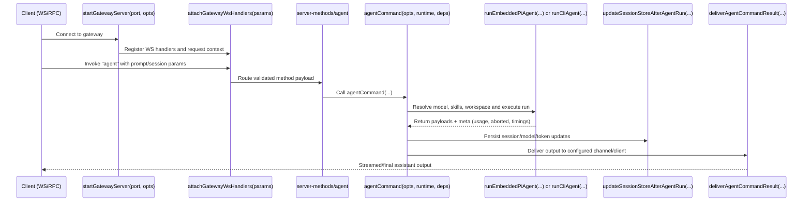

# Codebase Components (OpenClaw)

This guide gives you a practical map of the main runtime pieces so you can quickly decide where to add a feature, a command, or a channel integration.

## High-level architecture

```text
                               +----------------------+
                               |   Apps / Clients     |
                               |  (CLI, Web UI, RPC)  |
                               +----------+-----------+
                                          |
                             command / HTTP / WS / RPC
                                          |
                 +------------------------v------------------------+
                 |                    Entry Layer                 |
                 | src/cli/run-main.ts                            |
                 | src/cli/program/build-program.ts               |
                 | src/gateway/server.impl.ts                     |
                 +------------------------+------------------------+
                                          |
                 +------------------------v------------------------+
                 |               Command and RPC layer             |
                 | src/commands/*                                  |
                 | src/gateway/server-methods/*                    |
                 +------------------------+------------------------+
                                          |
                 +------------------------v------------------------+
                 |                 Agent execution core            |
                 | src/commands/agent.ts                           |
                 | src/agents/pi-embedded.ts / cli-runner.ts      |
                 | skills, model selection, session state          |
                 +------------------------+------------------------+
                                          |
             +----------------------------+----------------------------+
             |                                                         |
+------------v-----------+                                 +-----------v------------+
| Channel runtime        |                                 | Gateway runtime        |
| src/channels/plugins/* |                                 | src/gateway/*          |
| src/gateway/server-    |                                 | ws/http, auth, reload, |
| channels.ts            |                                 | cron, sidecars         |
+------------+-----------+                                 +-----------+------------+
             |                                                         |
             +----------------------------+----------------------------+
                                          |
                               +----------v-----------+
                               | Config and persistence|
                               | src/config/*          |
                               | sessions, secrets, fs |
                               +-----------------------+
```

## Main components and where to extend

- **CLI bootstrap and routing**
  - `runCli(argv: string[] = process.argv)` in `src/cli/run-main.ts`
  - `buildProgram()` in `src/cli/program/build-program.ts`
  - `tryRouteCli(argv: string[]): Promise<boolean>` in `src/cli/route.ts`
  - Add new user-facing command behavior in `src/cli/program/register.*.ts` and `src/commands/*`.

- **Dependency wiring for sends**
  - `createDefaultDeps(): CliDeps` in `src/cli/deps.ts`
  - `createOutboundSendDeps(deps: CliDeps): OutboundSendDeps` in `src/cli/deps.ts`
  - Add or adjust channel send adapters here when introducing new outbound paths.

- **Command execution layer**
  - `messageCommand(opts: Record<string, unknown>, deps: CliDeps, runtime: RuntimeEnv)` in `src/commands/message.ts`
  - `agentCommand(opts: AgentCommandOpts, runtime: RuntimeEnv = defaultRuntime, deps: CliDeps = createDefaultDeps())` in `src/commands/agent.ts`
  - Most feature work starts here for CLI and gateway-shared business logic.

- **Gateway server composition**
  - `startGatewayServer(port = 18789, opts: GatewayServerOptions = {}): Promise<GatewayServer>` in `src/gateway/server.impl.ts`
  - `attachGatewayWsHandlers(params: {...})` in `src/gateway/server-ws-runtime.ts`
  - Add WS or control-plane behavior in `src/gateway/server-methods/*` and shared server helpers.

- **Channel lifecycle and plugin runtime**
  - `listChannelPlugins(): ChannelPlugin[]` in `src/channels/plugins/index.ts`
  - `createChannelManager(opts: ChannelManagerOptions): ChannelManager` in `src/gateway/server-channels.ts`
  - Add a new channel plugin under `extensions/*` and ensure it exposes config + gateway hooks.

## Request flow sequence (gateway `agent` run)

This sequence shows the common path when a client triggers an agent run through the gateway control plane.



## Fast contributor checklist

- For a **new CLI command**, start in `src/cli/program/register.*.ts`, then implement in `src/commands/*`.
- For a **new gateway RPC**, add method handling in `src/gateway/server-methods/*`, then call into `src/commands/*` or shared infra.
- For **agent behavior changes**, begin with `src/commands/agent.ts`, then follow into `src/agents/*`.
- For **channel-specific features**, use channel plugins (`src/channels/plugins/*` or `extensions/*`) and runtime lifecycle in `src/gateway/server-channels.ts`.
- For **state/config changes**, update `src/config/*` and verify impact on sessions + reload paths in `src/gateway/server.impl.ts`.
