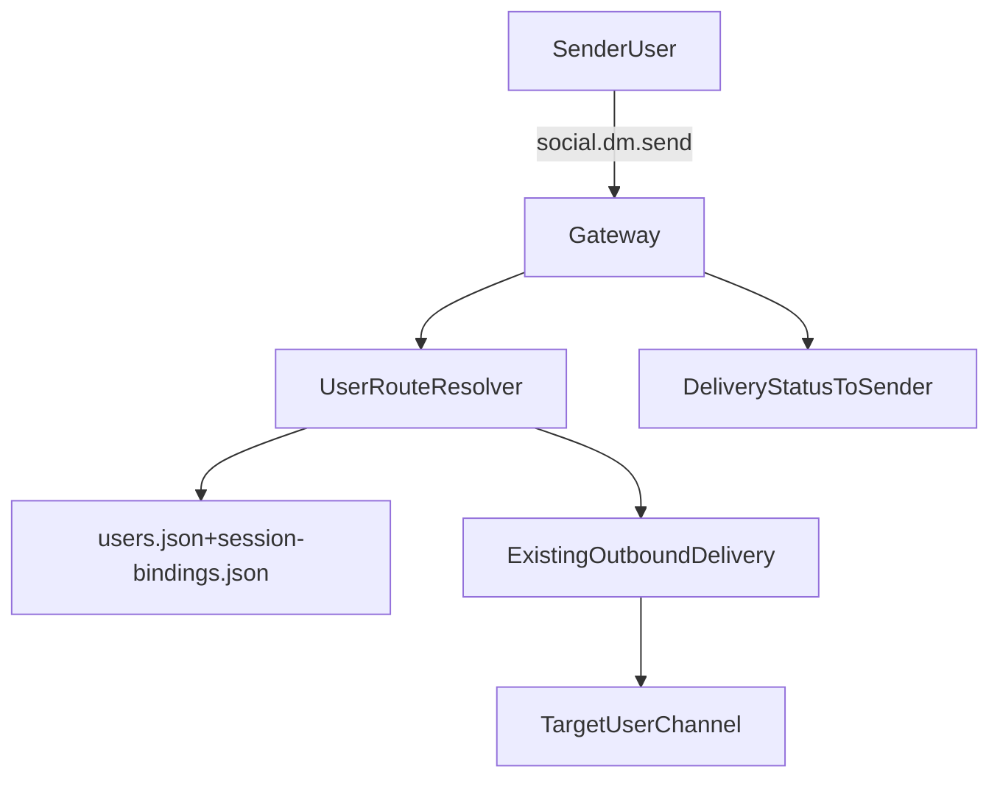
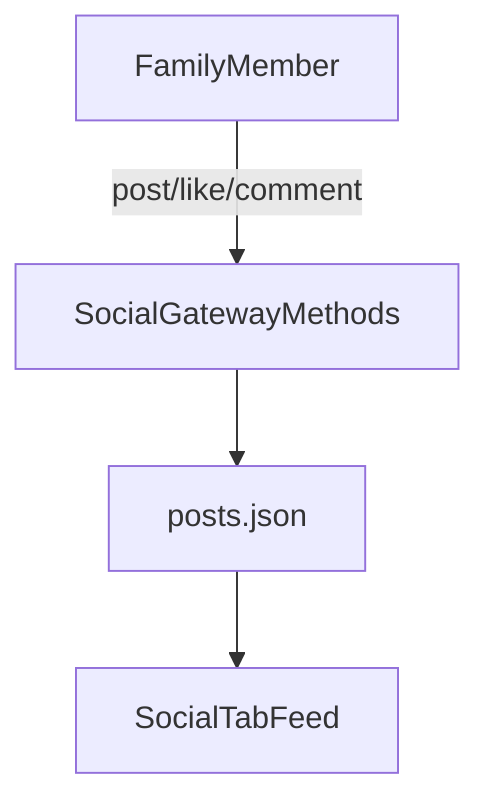

# Private Social Network Design

## 1) Goal

Design a family-focused private social network feature in `Forked/openclaw` that:

- stores users and social content in JSON files,
- keeps user discovery visible across all sessions,
- requires a pairing code when a user joins,
- allows user-to-user messaging through the agent,
- supports post, like, and comment interactions,
- and replaces user-facing `Custom/A2A` naming with **Private Social Network channel**.

This is a design artifact for implementation phase 2.

## 2) Product boundaries

### In scope

- Shared user registry visible in app UI.
- Pairing-code onboarding flow.
- User/session binding model.
- DM relay via gateway method to the target user/session route.
- Feed primitives: create post, like post, comment on post, list feed.
- Naming update from `Custom/A2A` to `Private Social Network channel`.
- Root-cause and mitigation design for cron announce `NO`-style outputs.

### Out of scope for phase 1

- Media upload pipeline for feed (text-first feed only).
- Follow graph, blocks, moderation roles.
- Push notification providers beyond current gateway/event flow.
- End-to-end cryptographic message encryption.

## 3) Storage model (JSON + file lock + atomic writes)

## Storage directory

Use gateway state directory:

- `<stateDir>/social/users.json`
- `<stateDir>/social/pairing-codes.json`
- `<stateDir>/social/session-bindings.json`
- `<stateDir>/social/posts.json`

`<stateDir>` is resolved with the same runtime pattern used by existing state-backed modules.

## Concurrency and durability

Reuse existing patterns from:

- `src/config/sessions/store.ts`
- `src/pairing/pairing-store.ts`
- `src/infra/json-files.ts`

Required behavior:

- lock before read/modify/write,
- re-read inside lock,
- write via temp file + atomic rename,
- best-effort prune/cleanup pass for expired codes and stale session bindings.

## Data schemas (logical)

### users.json

```json
{
  "version": 1,
  "users": [
    {
      "userId": "usr_01",
      "familyId": "fam_home_01",
      "displayName": "Alice",
      "handles": {
        "telegram": "@alice"
      },
      "reachability": {
        "preferred": {
          "channel": "telegram",
          "target": "@alice"
        }
      },
      "createdAt": 1772430000000,
      "updatedAt": 1772431000000
    }
  ]
}
```

### pairing-codes.json

```json
{
  "version": 1,
  "codes": [
    {
      "codeId": "pc_01",
      "code": "FAM-9X3K-42",
      "familyId": "fam_home_01",
      "issuedByUserId": "usr_admin",
      "maxUses": 1,
      "usedCount": 0,
      "expiresAt": 1772440000000,
      "createdAt": 1772435000000
    }
  ]
}
```

### session-bindings.json

```json
{
  "version": 1,
  "bindings": [
    {
      "userId": "usr_01",
      "sessionKey": "agent:main:telegram:direct:@alice",
      "active": true,
      "lastSeenAt": 1772437000000
    }
  ]
}
```

### posts.json

```json
{
  "version": 1,
  "posts": [
    {
      "postId": "pst_01",
      "familyId": "fam_home_01",
      "authorUserId": "usr_01",
      "text": "Dinner is ready at 7!",
      "createdAt": 1772438000000,
      "likes": ["usr_02"],
      "comments": [
        {
          "commentId": "cmt_01",
          "authorUserId": "usr_03",
          "text": "See you there",
          "createdAt": 1772438100000
        }
      ]
    }
  ]
}
```

## 4) Gateway API contract (phase 2 target)

Methods are additive and follow existing gateway naming conventions.

### User and pairing

- `social.user.pair.request`
  - Create a pairing code for a family.
- `social.user.join`
  - Register a user using a valid pairing code.
- `social.user.list`
  - Return visible users for current family context.
- `social.session.bind`
  - Bind current session key to a known user.

### Messaging relay

- `social.dm.send`
  - Resolve target user -> reachable route -> send message via existing outbound path.
  - Return delivery status and resolved route metadata.

### Feed

- `social.feed.post`
  - Create a text post.
- `social.feed.like`
  - Toggle or set like on a post.
- `social.feed.comment`
  - Add comment to a post.
- `social.feed.list`
  - List family feed with pagination cursor.

## 5) End-to-end flows

```mermaid
flowchart TD
  userApp[UserApp] -->|social.user.pair.request| gateway[Gateway]
  gateway --> socialStore[SocialStoreJSON]
  userApp -->|social.user.join(code)| gateway
  gateway --> socialStore
  userApp -->|social.session.bind| gateway
  gateway --> socialStore
  gateway --> userList[SharedUserListVisibleInApp]
```





## 6) User-facing naming updates

Replace user-facing `Custom/A2A` labels with **Private Social Network channel**.

Primary touchpoints:

- `src/channels/registry.ts`
- `ui/src/ui/app-render.helpers.ts`
- `ui/src/ui/controllers/chat.ts`

Design note:

- Keep internal protocol/method IDs stable (`a2a.*`) for compatibility.
- Update labels/titles/help copy only at first.

## 7) Root-cause: why assistant emits terse "NO"

Observed behavior is consistent with announce/silent-token flows:

- `src/agents/subagent-announce.ts` may direct reply-only silent behavior for duplicate/no-update delivery states.
- `src/cron/isolated-agent/delivery-dispatch.ts` treats silent-token output as delivered or suppressible in announce routing.

This can surface as terse non-user-friendly output in event streams when a run resolves to a no-op delivery branch.

## 8) Mitigation design for cron custom notify path

### Requirements

- No user-facing terse `NO`/silent token text in custom notify flow.
- Preserve duplicate suppression semantics.
- Preserve truthful delivery telemetry.

### Proposed mitigation

1. Introduce explicit no-op delivery state payload in cron custom notify completion:
   - `delivery: { status: "noop", reason: "duplicate_or_no_target" }`
2. Gate silent token rendering in this flow:
   - if synthesized output equals silent token, emit structured no-op status event only.
3. Keep run status finalization explicit:
   - `completed` with `delivery.status="sent"` when outbound happened,
   - `completed` with `delivery.status="noop"` when intentionally suppressed,
   - `failed` when delivery fails and best-effort is disabled.
4. Add regression tests for no-target and duplicate-target branches.

## 9) Implementation touchpoint matrix (fork only)

### Backend wiring

- `src/gateway/server-methods.ts` (register social handlers)
- `src/gateway/server-methods-list.ts` (advertise methods)
- `src/gateway/method-scopes.ts` (read/write scope mapping)
- `src/gateway/protocol/index.ts` (validators)
- `src/gateway/protocol/schema.ts` and `src/gateway/protocol/schema/protocol-schemas.ts` (schema exports)
- New:
  - `src/gateway/server-methods/social.ts`
  - `src/gateway/protocol/schema/social.ts`
  - `src/infra/social-store.ts`

### UI wiring

- `ui/src/ui/navigation.ts` (Social tab)
- `ui/src/ui/app.ts` and `ui/src/ui/app-view-state.ts` (state)
- `ui/src/ui/app-render.ts` (tab render routing)
- New:
  - `ui/src/ui/views/social.ts`
  - `ui/src/ui/controllers/social.ts`
- Existing user visibility surface:
  - `ui/src/ui/views/instances.ts`
  - `ui/src/ui/controllers/presence.ts`
  - `ui/src/ui/app-gateway.ts`

### Test surfaces

- Backend:
  - `src/gateway/protocol/index.test.ts`
  - `src/gateway/method-scopes.test.ts`
  - new `src/gateway/server-methods/social.test.ts`
  - new `src/infra/social-store.test.ts`
- UI:
  - `ui/src/ui/navigation.test.ts`
  - `ui/src/ui/app-settings.test.ts`
  - `ui/src/ui/controllers/chat.test.ts` (rename/transport label updates)
  - new tests for `ui/src/ui/controllers/social.ts` and `ui/src/ui/views/social.ts`
  - i18n tests for new keys

## 10) Migration note: openclaw -> forked/openclaw

During implementation:

- compare touched `openclaw` files against corresponding `Forked/openclaw` files,
- port only relevant diffs into `Forked/openclaw`,
- keep all new commits and tests in fork paths only.
